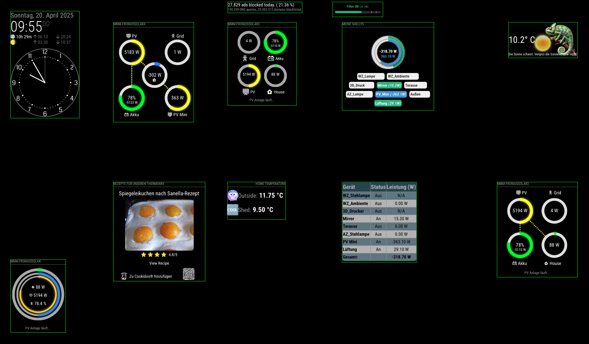
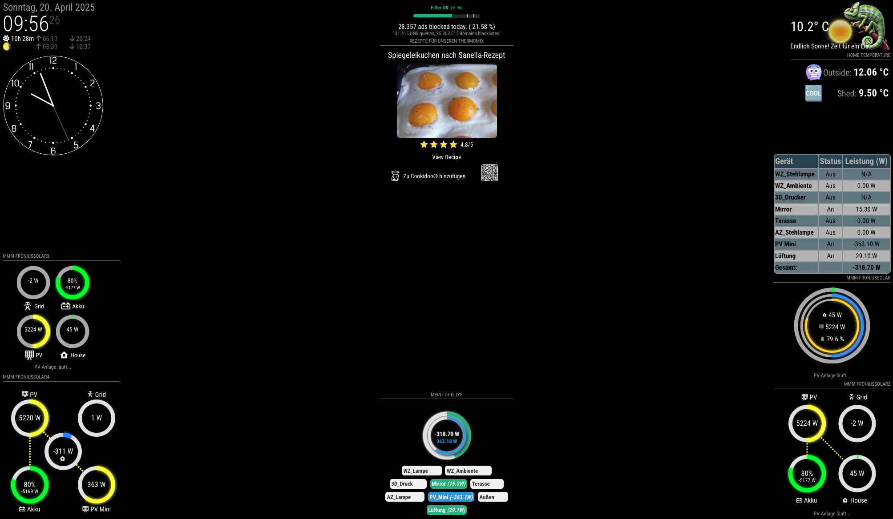

# MMM-GlobalPositioner
MagicMirror² module to globally reposition other modules on screen via fixed coordinates.

Positioned:


## Features

- 💯 **Absolute positioning** with exact pixel coordinates
- 🎯 Supports all four edges: `top`, `left`, `right`, `bottom`
- 🧩 Individual containers for each module
- 🚫 No conflicts with original module positioning
- 🔍 Built-in debug mode with visual guides
- ♻️ Automatic cleanup when disabled

## Installation

1. Clone into your `MagicMirror/modules` directory:
```bash
git clone https://github.com/ChrisF1976/MMM-GlobalPositioner.git
npm install
```

2. Add configuration to your `config.js`:

```javascript
{
  module: "MMM-GlobalPositioner",
  config: {
    debug: true,
    delay: 1000,
    maxAttempts: 5,
    modules: [
      {
        name: "clock",
        position: { top: 20, left: 20 }
      },
      {
        name: "calendar",
        position: { bottom: 30, right: 50 }
      }
      //add as much modules as you like
    ]
  }
},
```
## Config-Parameters

| Name         | Type    | Default  | Description                                                        |
|--------------|---------|----------|--------------------------------------------------------------------|
| `modules`    | Array   | `[]`     | List of modules with target positions                              |
| `delay`      | Number  | `1000`   | Delay in milliseconds before the first positioning attempt         |
| `maxAttempts`| Number  | `5`      | How many times the module tries to find and position other modules |
| `debug`      | Boolean | `true`   | If enabled, draws green borders around positioned containers       |


## How It Works

- Creates individual fixed-position containers
- Moves modules into their dedicated containers
- Applies precise positioning via CSS
- Maintains original module functionality

## Examples:

**Debug: true,**



**Original_Position**



## Troubleshooting

**Q: My module isn't moving**

- Verify the module name matches exactly
- Check browser console for errors
- Increase delay or maxAttempts

**Q: Elements overlap incorrectly**

- Adjust zIndex in your module config
- Use different coordinate pairs (top+left instead of bottom+right)
  
## License

MIT © [ChrisF1976]
