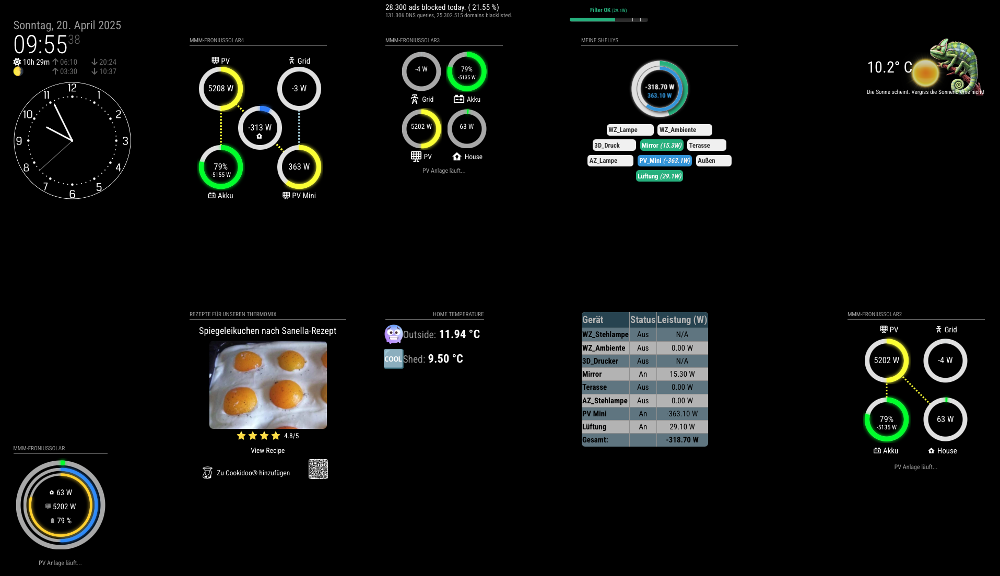

# MMM-GlobalPositioner
MagicMirror² module to globally reposition other modules on screen via fixed coordinates.



## Features

- 💯 **Absolute positioning** with exact pixel coordinates
- 🎯 Supports all four edges: `top`, `left`, `right`, `bottom`
- 🧩 Individual containers for each module
- 🚫 No conflicts with original module positioning
- 🔍 Built-in debug mode with visual guides
- ♻️ Automatic cleanup when disabled

## Installation

1. Clone into your `MagicMirror/modules` directory:
```bash
git clone https://github.com/your-repo/MMM-GlobalPositioner.git
```

2. Add configuration to your `config.js`:

```javascript
{
  module: "MMM-GlobalPositioner",
  config: {
    modules: [
      {
        name: "clock", // Must match module name exactly
        position: { 
                  top: 100,    // Position from top
                  right: 50    // Position from right
                   }
      //add as much modules as you like
      }
    ]
  }
},
```

#
